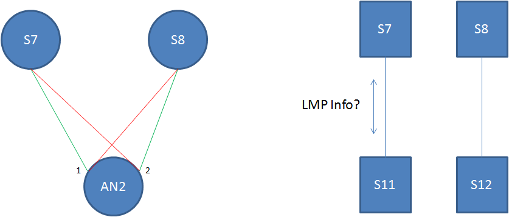
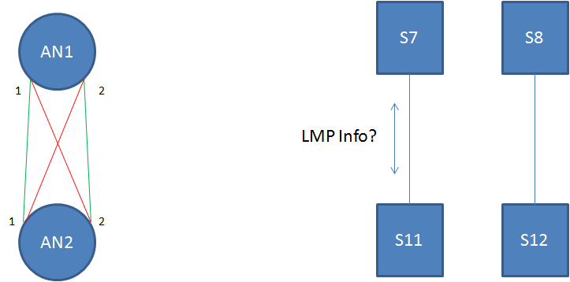
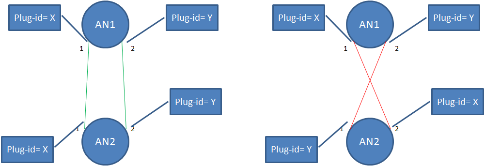
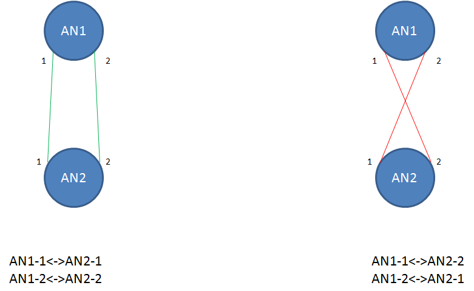

# Weekly Call (October 11, 2017)

## Attendees

- Italo Busi  
- Sergio Belotti  
- Carlo Perocchio  
- Gianmarco Bruno  
- Luis Miguel  
- Xu Yunbin  
- Young Lee  
- Yuji Tochio  

## Agenda:

1) Updates of Use Case 3 Analysis I-D  
2) Next steps for Use Case I-D (just adopted as CCAMP WG document)  
3) Updated JSON code for Use Case 1  
     3.1) I2RS topology attributes  
     3.2) TE Tunnel attributes for ODU2 transit service  
4) AOB  

## Meeting Notes:

### 1) Updates of Use Case 3 Analysis I-D

Proposed updated draft uploaded on GitHub: [https://github.com/danielkinguk/transport-nbi/pull/9](https://github.com/danielkinguk/transport-nbi/pull/9)  

Section 3.1.2: Comment was raised about the fact plug-id and LMP dicovery functionality can also be assiciated , in the esense that Plug-id can be discovered via LMP. At  the same time LMP can be used anyway for discovering neighbor domains.  
There are two possibility to use LMP in this context: LMP is configured in the node, or , PNC is directly part of LMP process sending information  towards the node (like Openflow does).  
..  
It is not clear how to correlate the information exchanged via LMP-based auto-discovery by the physical nodes with abstract information to be reported at the MPI. The issue is how to understand whether the inter-domain links are the "green" or the "red" ones in the figure below:  

  
The key issue is how to abstract the information gathered by LMP-based auto-discover to be consistent with the abstraction levels provided at the MPI  

During the discussion the case where abstract nodes are used has been considered:  

A second option is to have the plug-id information "assigned and managed by a central network authority". This information is properly configured on both adjacent PNC domains and used by the MDSC to discover inter-domain  links:  

A third option that was discussed, is to configure the inter-domain links within the MDSC.  

However, it was not clear how the MDSC can know the nodeID/linkID information the adjancent PNCs assigns to each inter-domain link.  

A fourth option based on using the remote nodeID/linkID as described in draft-ietf-teas-yang-te-topo-12\. This option has not yet been fully investigated.  

**Discussion to be continued on the mailing list and on the next DT calls.**  

### 2) Next steps for Use Case I-D (just adopted as CCAMP WG document)

Not discussed because of lack of time.

### 3) Updated JSON code for Use Case 1

The current version on the JSON codes for Use Case 1 are available on GitHub and are based on the auto-generated JSON code with few comments manually inserted and fixed to fit into the 32-character width available, as uploaded by pull request:  

[https://github.com/danielkinguk/transport-nbi/pull/8](https://github.com/danielkinguk/transport-nbi/pull/8)  

Thanks to Gianmarco and Ricard for their support  

These versions are been taken as an input for updating the JSON code with I2RS topology attributes.  

#### 3.1) I2RS topology attributes for Use Case 1

Initial proposal for I2RS attributes uploaded on GitHub: [https://github.com/danielkinguk/transport-nbi/pull/10](https://github.com/danielkinguk/transport-nbi/pull/10)  

Not discussed because of lack of time.  

**Discussion to be started on the mailing list and on the next DT calls.**  

#### 3.2) TE Tunnel attributes for ODU2 transit service in Use Case 1

**Question: which version should be consider?**  

Proposed updates to the JSON code uploaded on GitHub: [https://github.com/danielkinguk/transport-nbi/pull/11](https://github.com/danielkinguk/transport-nbi/pull/11)  

**Discussion to be started on the mailing list and on the next DT calls.**  

### 5) AOB

The next DT call is planned on October 18, 2017 at 3:00pm CEST  

## Note Takers

- Italo Busi
